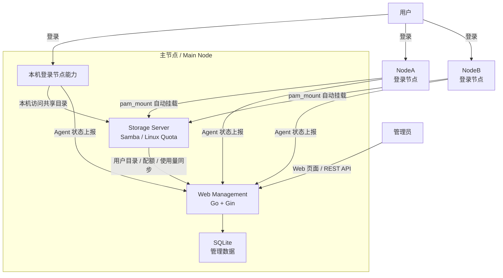

# Server Storage Management System

基于 Linux、Samba 和 Go 实现的共享存储管控系统。

## 项目简介

本项目旨在构建一个面向多用户、多服务器环境的共享存储管控平台。用户可以登录任意服务器节点访问自己的数据，实现数据集中存储和跨节点共享，同时保证用户之间的数据隔离和存储配额管理。

系统采用 Samba 作为共享存储服务，通过 Linux 用户权限机制实现访问控制，并提供 Web 管理后台用于查看服务器状态、用户存储配额以及空间使用情况。

---

## 功能特性

### 用户数据隔离

- 每个用户拥有独立存储目录
- 用户仅能访问自己的文件
- 禁止访问其他用户数据

### 跨服务器数据访问

- 支持多个服务器节点
- 用户登录任意节点均可访问相同数据
- 数据集中存储，避免文件分散
- Windows/macOS 可通过任意节点的 SMB 网关访问中心共享

### 自动挂载

- 用户登录后自动挂载个人共享目录
- 无需手动连接共享存储

### 存储空间管理

- 为用户分配最大可用空间
- 统计用户已使用空间
- 支持存储使用情况查询

### 管理后台

- 用户管理
- 配额管理
- 存储空间统计
- 服务器状态监控
- 日志查看

---

## 系统架构



### 节点说明

#### Storage Server

负责：

- Samba 共享存储
- 用户目录管理
- 权限控制
- 存储空间管理
- 也可以作为登录节点，供用户直接登录并访问个人共享目录

#### NodeA / NodeB

负责：

- 用户登录
- 自动挂载共享目录
- 访问共享存储

#### Web Management

负责：

- 用户管理
- 配额管理
- 空间统计
- 状态监控
- 日志管理

---

## 技术栈

### 服务端

- Go
- Gin
- SQLite

### 存储服务

- Samba (SMB)

### 系统平台

- Linux
- Ubuntu Server

### 系统管理

- systemd
- Bash Script

### 状态采集

- gopsutil

---

## 项目结构

```text
ServerStorageManagementSystem/
├── server/
│   ├── api/
│   ├── database/
│   ├── models/
│   ├── service/
│   ├── templates/
│   └── main.go
├── agent/
│   ├── README.md
│   ├── main.go
│   └── storage-agent.service
├── scripts/
│   ├── create_node_user.sh
│   ├── create_user.sh
│   ├── delete_node_user.sh
│   ├── delete_user.sh
│   ├── apply_site_config.sh
│   ├── install_management_server.sh
│   ├── install_node_agent.sh
│   ├── install_node_client.sh
│   ├── install_smb_gateway.sh
│   ├── install_storage_agent.sh
│   ├── install_storage_server.sh
│   ├── deploy_smb_gateways.sh
│   ├── join_node.sh
│   ├── leave_node.sh
│   ├── quota_manager.sh
│   ├── request_user_delete.sh
│   ├── request_user_sync.sh
│   ├── storage_usage_report.sh
│   ├── ssmsctl
│   ├── sync_delete_user.sh
│   ├── sync_user.sh
│   ├── test_mount.sh
│   └── uninstall_management_server.sh
├── configs/
│   ├── nodes.conf
│   ├── pam_mount.conf.xml
│   ├── site.env.example
│   ├── smb.conf
│   ├── storage-agent.env.example
│   ├── storage-agent.service
│   ├── storage-server.env.example
│   ├── storage-server.service
│   ├── sync.conf
│   └── system.conf
├── docs/
│   ├── deployment/
│   └── design/
├── go.mod
├── go.sum
├── README.md
└── LICENSE
```

统一运维入口：

```bash
ssmsctl --help
sudo ssmsctl user create alice --quota-gb 10
sudo ssmsctl node join NodeC 192.168.1.215 nodec1
```

完整命令说明见 `docs/deployment/ssmsctl.md`。

---

## 开发计划

### 第一阶段：基础环境搭建

- Ubuntu Server 部署
- Samba 共享存储搭建
- 用户目录创建
- 权限控制配置

### 第二阶段：存储服务实现

- 自动挂载脚本
- 用户管理脚本
- 配额管理实现
- 跨节点访问测试

### 第三阶段：管理后台开发

- 数据库设计
- 用户管理模块
- 配额管理模块
- 存储统计模块

### 第四阶段：监控与测试

- 节点状态监控
- 日志管理
- 功能测试
- 系统联调

---

## 团队分工

### 成员 A：系统与存储

负责：

- Linux 服务器部署
- Samba 共享存储配置
- 用户管理与权限控制
- 用户目录自动创建
- 自动挂载脚本开发
- 存储配额管理
- 测试环境搭建与维护

负责目录：

```text
configs/
scripts/
docs/deployment/
```

### 成员 B：平台与后台

负责：

- Go Web 后台开发
- SQLite 数据库设计
- 用户管理模块
- 配额管理模块
- 存储使用统计模块
- 节点状态监控模块
- 日志管理模块
- 前端管理页面开发

负责目录：

```text
server/
agent/
docs/design/
```

---

## 运行环境

### Storage Server

- Ubuntu Server 26.04 LTS
- Samba 4.x

### Node Server

- Ubuntu Server 26.04 LTS

### Management Server

- Go 1.24+
- SQLite 3.x

---

## 项目目标

实现一个支持多用户、多服务器节点的共享存储管控系统，使用户能够在任意服务器节点访问自己的数据，并通过统一管理后台实现用户管理、权限控制、存储配额管理和系统监控。

---

## License

MIT License
