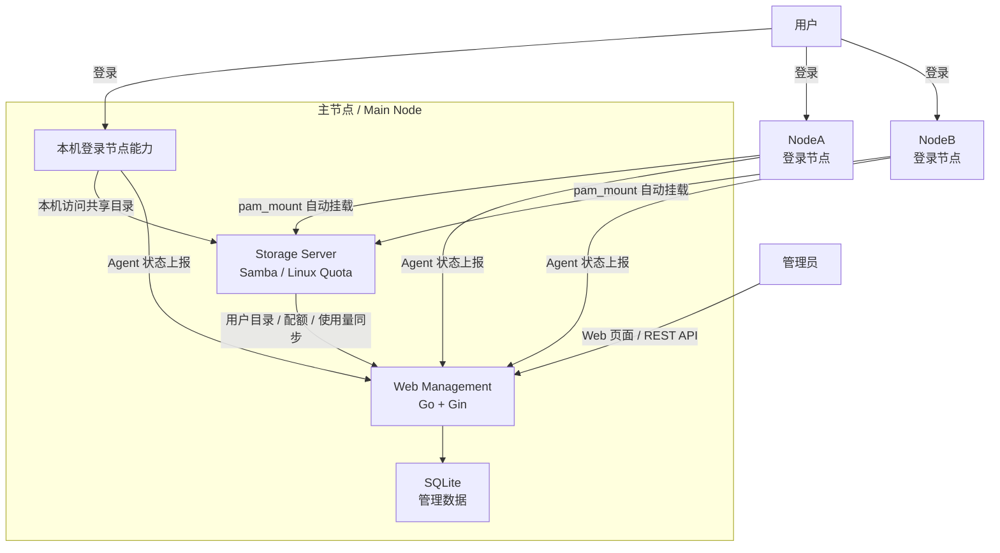

# Server Storage Management System

基于 Linux、Samba、Go 和 SQLite 的共享存储管控系统。系统面向多用户、多节点场景，用户可在任意登录节点访问自己的集中存储目录，管理员可通过 Web 后台查看用户、配额、用量、节点状态和日志。

## 核心能力

- 用户隔离：每个用户拥有独立目录，目录权限和 Samba 访问控制共同隔离数据。
- 集中存储：用户数据集中保存在 Storage Server，登录节点通过 SMB/CIFS 访问。
- 自动挂载：登录节点通过 `pam_mount` 自动挂载用户个人共享目录。
- 配额管理：使用 Linux quota 限制用户存储空间，并同步到管理后台。
- 节点监控：Agent 定时上报 CPU、内存、磁盘和在线状态。
- 管理后台：提供用户管理、配额修改、存储统计、节点监控和日志筛选。
- 统一命令：`ssmsctl` 封装常用用户、节点、配额、Gateway 和系统检查操作。

## 系统架构



## 组件说明

| 组件 | 作用 |
| --- | --- |
| Storage Server | 保存用户目录，提供 Samba 共享，执行 Linux quota，也可作为登录节点 |
| Login Node | 提供用户登录入口，通过 `pam_mount` 挂载中心存储 |
| SMB Gateway | 让 Windows/macOS 通过任意节点访问中心共享 |
| Web Management | Go + Gin 管理后台，提供页面和 REST API |
| Agent | 节点状态采集进程，通过 systemd 常驻运行 |
| SQLite | 保存后台管理数据、节点状态、存储统计和日志 |

## 快速启动

全新 Ubuntu 虚拟机推荐直接使用一键部署。进入项目目录后先做预检查：

```bash
cd ~/ServerStorageManagementSystem
chmod +x scripts/*.sh scripts/ssmsctl
sudo scripts/ssmsctl system bootstrap --host 192.168.1.230 --check-only
```

预检查通过后执行部署：

```bash
sudo scripts/ssmsctl system bootstrap --host 192.168.1.230
```

脚本会安装 Samba、quota、管理后台、Storage Agent、用量同步定时器和
`ssmsctl`，并生成管理后台初始管理员密码。部署说明见
[docs/deployment/bootstrap-storage-server.md](docs/deployment/bootstrap-storage-server.md)。

开发运行管理后台：

```bash
go run ./server -addr 0.0.0.0:8080 -db server-storage.db
```

访问：

```text
http://服务器IP:8080
```

已有配置的生产或演示环境也可以使用安装脚本生成 systemd 服务：

```bash
sudo scripts/install_management_server.sh
sudo systemctl status storage-server
```

节点 Agent 从项目根目录构建：

```bash
go build -o bin/storage-agent ./agent
```

详细部署步骤见 [docs/design/runbook.md](docs/design/runbook.md) 和 [docs/deployment/README.md](docs/deployment/README.md)。

## 统一命令

安装脚本会把 `ssmsctl` 放到 `/usr/local/bin/ssmsctl`：

```bash
ssmsctl --help
ssmsctl system status
ssmsctl user list
sudo ssmsctl user create alice --quota-gb 10
sudo ssmsctl quota set alice 20
sudo ssmsctl node join NodeC 192.168.1.215 nodec1
sudo ssmsctl usage sync
sudo ssmsctl system bootstrap --host 192.168.1.230 --check-only
```

完整说明见 [docs/deployment/ssmsctl.md](docs/deployment/ssmsctl.md)。

## 常用文档

- [文档总览](docs/README.md)：按设计、部署和测试报告分类导航。
- [运行手册](docs/design/runbook.md)：后端、Agent、systemd、接口测试和故障排查。
- [API 文档](docs/design/api.md)：REST API 路径、请求和响应。
- [数据库设计](docs/design/database.md)：SQLite 表结构。
- [部署文档索引](docs/deployment/README.md)：功能说明、部署步骤、命令和验收方案。
- [测试报告索引](docs/reports/README.md)：历史实测过程、问题和结论。
- [Agent 说明](agent/README.md)：Agent 构建、安装和 systemd 配置。

## 项目结构

```text
server/      Go 管理后台、页面、REST API 和 SQLite 访问
agent/       节点状态采集 Agent
scripts/     安装、用户同步、配额、节点和 Gateway 脚本
configs/     systemd、Samba、pam_mount 和站点配置模板
docs/design/ 设计文档、API、数据库和运行手册
docs/deployment/ 功能说明、部署步骤、命令参考和验收方案
docs/reports/ 已执行测试的过程、问题和结论
```

## 技术栈

- Go / Gin
- SQLite
- Samba / SMB / CIFS
- Linux quota
- systemd
- Bash
- gopsutil

## License

MIT License
